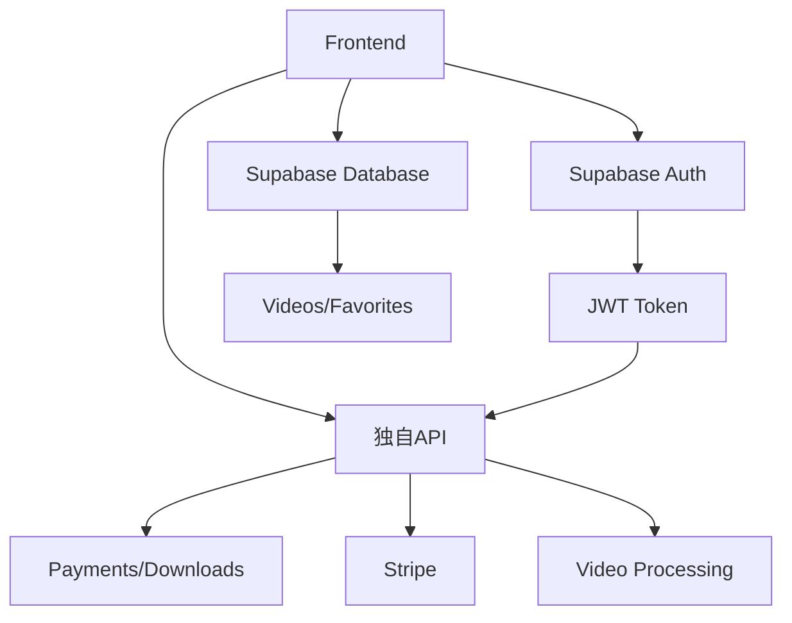

# VeoMaster Pro 統合戦略
## Supabase + 独自API最適統合

### 🎯 **役割分担最適化**

#### **Supabase が担当**
- ✅ ユーザー認証 (Auth)
- ✅ 動画メタデータ (videos table)
- ✅ お気に入り (favorites table)  
- ✅ カスタムオーダー (custom_orders table)
- ✅ ユーザープロフィール基本情報

#### **独自API が担当**
- 🚀 **Stripe決済処理** (高セキュリティ)
- 🚀 **サブスクリプション管理** (複雑ビジネスロジック)
- 🚀 **動画ダウンロード制御** (認可・制限)
- 🚀 **ウォーターマーク処理** (FFmpeg)
- 🚀 **使用量追跡・分析** (詳細ログ)

### 🔄 **データフロー設計**



### 📋 **統合手順**

#### **Phase 1: 認証統合**
```typescript
// Frontend: Supabase Auth + 独自API Token Exchange
const loginWithSupabase = async (email, password) => {
  // 1. Supabase認証
  const { data: authData } = await supabase.auth.signInWithPassword({email, password})
  
  // 2. 独自APIトークン取得
  const apiToken = await fetch('/api/auth/exchange', {
    headers: { 'Authorization': `Bearer ${authData.session.access_token}` }
  })
  
  // 3. 両方のトークンを保存
  localStorage.setItem('supabase_token', authData.session.access_token)
  localStorage.setItem('api_token', apiToken.access_token)
}
```

#### **Phase 2: データ同期**
```typescript
// Frontend: 動画データはSupabase、決済は独自API
const VideoComponent = () => {
  const [videos] = useSupabaseQuery('videos')
  const [subscription] = useApiQuery('/api/payments/subscription')
  
  const handleDownload = async (videoId) => {
    // 独自APIで認可チェック + ダウンロードリンク生成
    const downloadUrl = await apiClient.post(`/api/videos/${videoId}/download`)
    window.open(downloadUrl)
  }
}
```

#### **Phase 3: 料金プラン更新**
```typescript
// VeoMaster Pro正式価格に更新
const VEOMASTER_PLANS = [
  {
    id: 'basic',
    name: 'ベーシック', 
    price: 49800,
    downloads: 30
  },
  {
    id: 'standard', 
    name: 'スタンダード',
    price: 98000,
    downloads: 100
  },
  {
    id: 'premium',
    name: 'プレミアム', 
    price: 148000,
    downloads: 300
  },
  {
    id: 'unlimited',
    name: '無制限',
    price: 198000, 
    downloads: -1
  }
]
```

### 🎨 **UI/UX 改善ポイント**

#### **1. プレミアム感向上**
- 高級ブランドカラー (ダーク + ゴールドアクセント)
- ガラスモーフィズム効果
- マイクロアニメーション

#### **2. 動画ギャラリー強化**
- Masonry レイアウト
- 高速プレビュー
- AI推奨システム表示
- カテゴリフィルター強化

#### **3. 決済フロー最適化**
- Stripe Elements統合
- リアルタイム価格計算
- サブスクリプション管理ダッシュボード

### ⚡ **今すぐ実装可能な改善**

1. **価格プラン更新** → PricingPlans.tsx
2. **認証フロー統合** → AuthContext.tsx  
3. **動画ダウンロード** → VideoGrid.tsx
4. **UI プレミアム化** → 全コンポーネント
5. **Stripe統合** → 決済フロー

どこから開始しますか？

- 🏠 **ランディングページ** のプレミアム化
- 💰 **料金プラン** の正式価格更新  
- 🎬 **動画ギャラリー** のUX改善
- 🔐 **認証システム** の統合最適化

今すぐ始めましょう！🚀